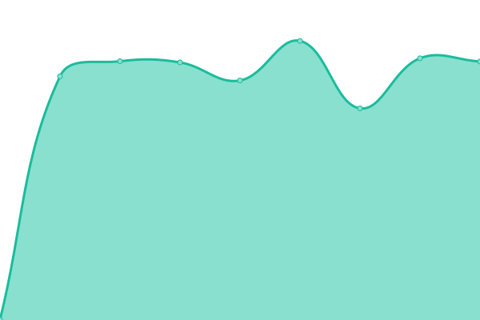
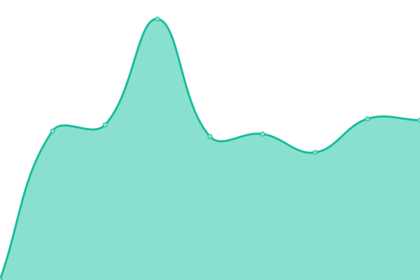
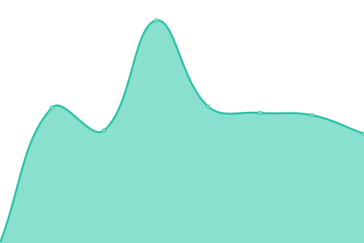
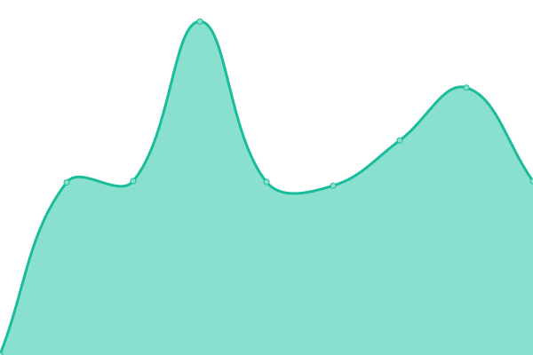
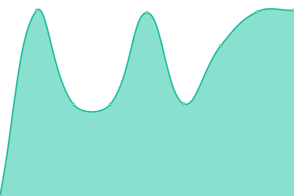
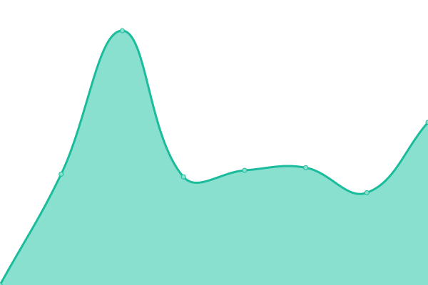
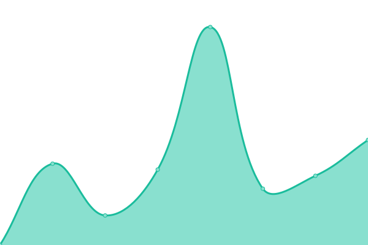
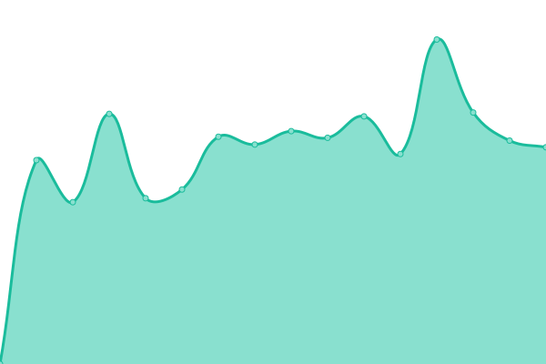

# [📈 Live Status](https://ctxwing.github.io/upptime): <!--live status--> **🟧 Partial outage**

This repository contains the open-source uptime monitor and status page for [ctxwing](https://ctxwing.github.io/upptime), powered by [Upptime](https://github.com/upptime/upptime).

With [Upptime](https://upptime.js.org), you can get your own unlimited and free uptime monitor and status page, powered entirely by a GitHub repository. We use [Issues](https://github.com/ctxwing/upptime/issues) as incident reports, [Actions](https://github.com/ctxwing/upptime/actions) as uptime monitors, and [Pages](https://ctxwing.github.io/upptime) for the status page.

<!--start: status pages-->
<!-- This summary is generated by Upptime (https://github.com/upptime/upptime) -->
<!-- Do not edit this manually, your changes will be overwritten -->
<!-- prettier-ignore -->
| URL | Status | History | Response Time | Uptime |
| --- | ------ | ------- | ------------- | ------ |
|  [contrixlab](https://www.contrixlab.com) | 🟩 Up | [contrixlab.yml](https://github.com/ctxwing/upptime/commits/HEAD/history/contrixlab.yml) | 

 1638ms
     
 | 

<a href="https://ctxwing.github.io/upptime/history/contrixlab">100.00%</a>
    

|  [3dcrafts.net](https://www.3dcrafts.net) | 🟩 Up | [3dcrafts-net.yml](https://github.com/ctxwing/upptime/commits/HEAD/history/3dcrafts-net.yml) | 

 1841ms
     
 | 

<a href="https://ctxwing.github.io/upptime/history/3dcrafts-net">100.00%</a>
    

|  [3dcrafts.co.kr](https://www.3dcrafts.co.kr) | 🟩 Up | [3dcrafts-co-kr.yml](https://github.com/ctxwing/upptime/commits/HEAD/history/3dcrafts-co-kr.yml) | 

 1289ms
     
 | 

<a href="https://ctxwing.github.io/upptime/history/3dcrafts-co-kr">100.00%</a>
    

|  [virtual exhibition panel](https://www.contrixlab.com) | 🟩 Up | [virtual-exhibition-panel.yml](https://github.com/ctxwing/upptime/commits/HEAD/history/virtual-exhibition-panel.yml) | 

 785ms
     
 | 

<a href="https://ctxwing.github.io/upptime/history/virtual-exhibition-panel">100.00%</a>
    

|  [virtual exhibition 1](https://ctx.contrixlab.co.kr/main/app-files/) | 🟩 Up | [virtual-exhibition-1.yml](https://github.com/ctxwing/upptime/commits/HEAD/history/virtual-exhibition-1.yml) | 

 940ms
     
 | 

<a href="https://ctxwing.github.io/upptime/history/virtual-exhibition-1">100.00%</a>
    

|  [virtual exhibition 2](https://ctx2.contrixlab.co.kr/main/app-files/) | 🟩 Up | [virtual-exhibition-2.yml](https://github.com/ctxwing/upptime/commits/HEAD/history/virtual-exhibition-2.yml) | 

 925ms
     
 | 

<a href="https://ctxwing.github.io/upptime/history/virtual-exhibition-2">100.00%</a>
    

|  [virtual exhibition 3](https://ctx3.contrixlab.co.kr/main/app-files/) | 🟩 Up | [virtual-exhibition-3.yml](https://github.com/ctxwing/upptime/commits/HEAD/history/virtual-exhibition-3.yml) | 

 902ms
     
 | 

<a href="https://ctxwing.github.io/upptime/history/virtual-exhibition-3">100.00%</a>
    

|  [virtual exhibition 4](https://ctx4.contrixlab.co.kr/main/app-files/) | 🟩 Up | [virtual-exhibition-4.yml](https://github.com/ctxwing/upptime/commits/HEAD/history/virtual-exhibition-4.yml) | 

 955ms
     
 | 

<a href="https://ctxwing.github.io/upptime/history/virtual-exhibition-4">100.00%</a>
    

|  [happyseum](https://www.happyseum.com/page/index?tpl=etc%2F3dconfigurator.html) | 🟩 Up | [happyseum.yml](https://github.com/ctxwing/upptime/commits/HEAD/history/happyseum.yml) | 

 1118ms
     
 | 

<a href="https://ctxwing.github.io/upptime/history/happyseum">100.00%</a>
    

|  [rainus-lobby](https://dev.contrixlab.com/rainus/lobby/app-files/) | 🟩 Up | [rainus-lobby.yml](https://github.com/ctxwing/upptime/commits/HEAD/history/rainus-lobby.yml) | 

 876ms
     
 | 

<a href="https://ctxwing.github.io/upptime/history/rainus-lobby">100.00%</a>
    

|  [rainus-fresh](https://dev.contrixlab.com/rainus/fresh/app-files/) | 🟩 Up | [rainus-fresh.yml](https://github.com/ctxwing/upptime/commits/HEAD/history/rainus-fresh.yml) | 

 152ms
     
 | 

<a href="https://ctxwing.github.io/upptime/history/rainus-fresh">100.00%</a>
    

|  [rainus-electro](https://dev.contrixlab.com/rainus/electro/app-files/) | 🟩 Up | [rainus-electro.yml](https://github.com/ctxwing/upptime/commits/HEAD/history/rainus-electro.yml) | 

 302ms
     
 | 

<a href="https://ctxwing.github.io/upptime/history/rainus-electro">100.00%</a>
    

|  [forexcom-gisc2022-main](https://biz.contrixlab.com/gisc2022/) | 🟩 Up | [forexcom-gisc2022-main.yml](https://github.com/ctxwing/upptime/commits/HEAD/history/forexcom-gisc2022-main.yml) | 

 646ms
     
 | 

<a href="https://ctxwing.github.io/upptime/history/forexcom-gisc2022-main">100.00%</a>
    

|  [forexcom-gisc2022-gaudio](https://biz.contrixlab.com/gisc2022/gaudio/app-files/) | 🟩 Up | [forexcom-gisc2022-gaudio.yml](https://github.com/ctxwing/upptime/commits/HEAD/history/forexcom-gisc2022-gaudio.yml) | 

 124ms
     
 | 

<a href="https://ctxwing.github.io/upptime/history/forexcom-gisc2022-gaudio">100.00%</a>
    

|  [forexcom-gisc2022-locaila](https://biz.contrixlab.com/gisc2022/locaila/app-files/) | 🟩 Up | [forexcom-gisc2022-locaila.yml](https://github.com/ctxwing/upptime/commits/HEAD/history/forexcom-gisc2022-locaila.yml) | 

 125ms
     
 | 

<a href="https://ctxwing.github.io/upptime/history/forexcom-gisc2022-locaila">100.00%</a>
    

|  [forexcom-gisc2022-klleon](https://biz.contrixlab.com/gisc2022/klleon/app-files/) | 🟩 Up | [forexcom-gisc2022-klleon.yml](https://github.com/ctxwing/upptime/commits/HEAD/history/forexcom-gisc2022-klleon.yml) | 

 125ms
     
 | 

<a href="https://ctxwing.github.io/upptime/history/forexcom-gisc2022-klleon">100.00%</a>
    

|  [jeondochi tunnel](https://lancer.contrixlab.com) | 🟩 Up | [jeondochi-tunnel.yml](https://github.com/ctxwing/upptime/commits/HEAD/history/jeondochi-tunnel.yml) | 

 1653ms
     
 | 

<a href="https://ctxwing.github.io/upptime/history/jeondochi-tunnel">100.00%</a>
    

|  [IY-DA](https://www.iy-da.co.kr/) | 🟩 Up | [iy-da.yml](https://github.com/ctxwing/upptime/commits/HEAD/history/iy-da.yml) | 

 2387ms
     
 | 

<a href="https://ctxwing.github.io/upptime/history/iy-da">100.00%</a>
    

|  [Test Broken Site](https://thissitedoesnotexist.koj.co) | 🟥 Down | [test-broken-site.yml](https://github.com/ctxwing/upptime/commits/HEAD/history/test-broken-site.yml) | 

 0ms
     
 | 

<a href="https://ctxwing.github.io/upptime/history/test-broken-site">100.00%</a>
    

<!--end: status pages-->

[**Visit our status website →**](https://ctxwing.github.io/upptime)

## 📄 License

- Powered by: [Upptime](https://github.com/upptime/upptime)
- Code: [MIT](./LICENSE) © [ctxwing](https://ctxwing.github.io/upptime)
- Data in the `./history` directory: [Open Database License](https://opendatacommons.org/licenses/odbl/1-0/)
